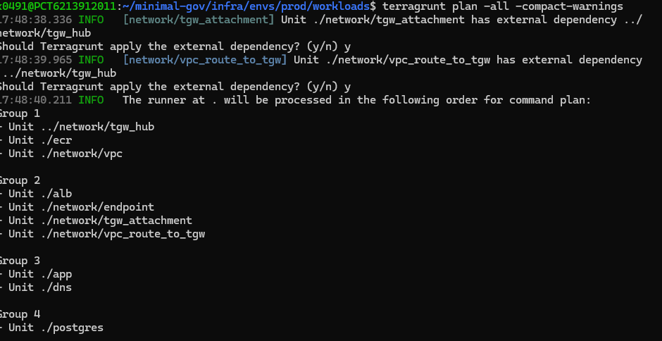
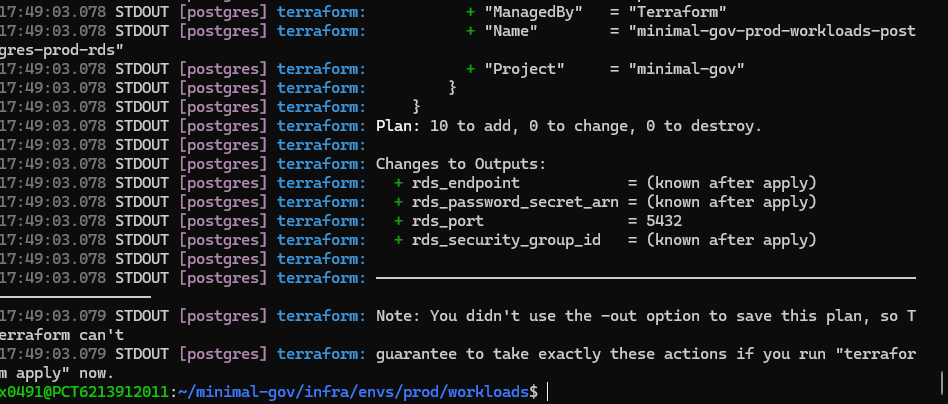
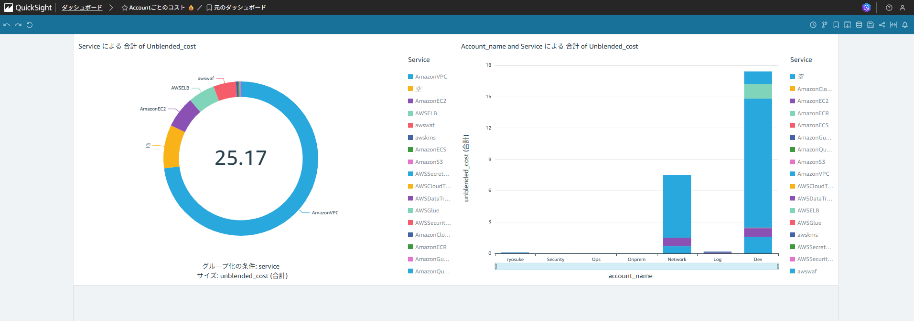
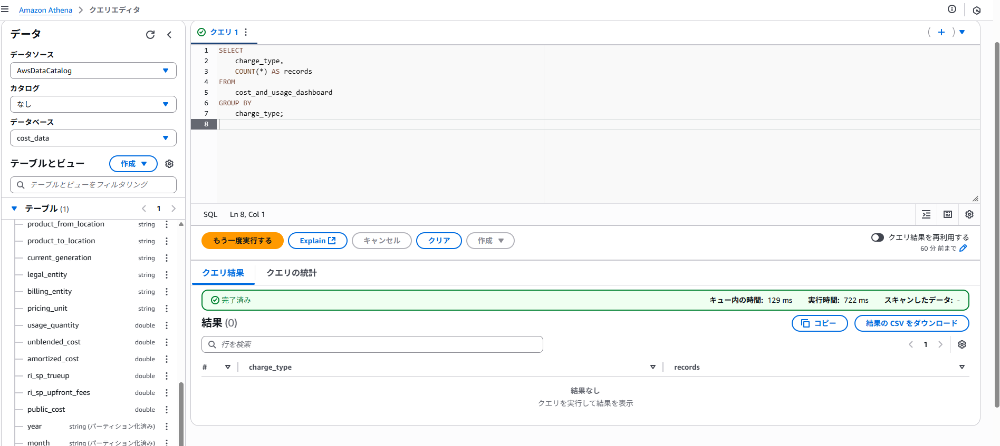
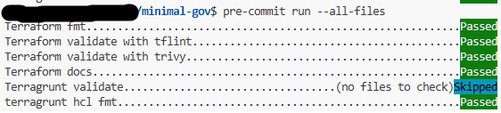

<div align="center">

# Minimal Gov

</div>
AWS × Terraform × Terragrunt – ガバナンスの効いた最小構成マルチアカウント / 閉域網 IaC ポートフォリオ

このリポジトリは、実務で触っていた環境を出来るだけ模して、個人ポートフォリオとして構築した IaC 一式です。
AWS のベストプラクティス（分離・最小権限・自動化）をできるだけシンプルな構成で再現し、ネットワーク分離 + ゲートウェイ集中（TGW） + WAF/ALB + ECS(Fargate) + RDS(PostgreSQL) + Private DNS を最小セットで動かします。

## 🧭Architecture


Transit Gateway をハブにして network（共通 NW）と workloads（業務 VPC）を接続
ワークロード側は ALB+WAF → ECS(Fargate) / RDS(PostgreSQL) / PrivateHostZoneを使用


## 🔢Version
Terraform: v1.13.3
Terragrunt: v0.87.3
Lint/Sec: tflint, trivy
Git hooks: pre-commit（fmt / validate / tflint / trivy / docs）


## 📂ディレクトリ構成
```
infra
├── envs
│   ├── dev
│   │   ├── env.hcl
│   │   ├── network
│   │   └── workloads
│   └── prod
│       ├── env.hcl
│       ├── network
│       └── workloads
├── modules
│   ├── compute
│   │   ├── ec2_bastion
│   │   ├── ecr
│   │   └── ecs_fargate
│   ├── grobal
│   │   ├── oidc
│   │   ├── organizations
│   │   └── scp
│   ├── network
│   │   ├── alb_waf
│   │   ├── endpoint
│   │   ├── route53_private_zone
│   │   ├── tgw_hub
│   │   ├── tgw_route
│   │   ├── tgw_vpc_attachment
│   │   ├── tgw_vpc_attachment_accepter
│   │   ├── vpc
│   │   └── vpc_route_to_tgw
│   └── storage
│       ├── backend
│       └── rds
└── organization
    ├── oidc
    │   ├── dev
    │   └── prod
    ├── organizations
    │   ├── README.md
    │   ├── backend.tf
    │   ├── main.tf
    │   ├── outputs.tf
    │   ├── policies
    │   ├── provider.tf
    │   ├── sso
    │   ├── terraform.tfvars
    │   └── variables.tf
    └── state_backend
        ├── README.md
        ├── backend.tf
        ├── main.tf
        ├── outputs.tf
        ├── provider.tf
        ├── terraform.tfvars
        └── variables.tf

```

## ☁️AWS Organizationから完全Iac化
マルチアカウント環境を模し、ランディングゾーンのセットアップから組織単位の管理まで Terraform で一元管理可能にしています。

## 🧩DRY原則の徹底
Terragrunt の DRY & Fascade パターンを採用。
input に値を渡すだけで構築可能となっており、シンプルかつ再利用性の高い IaC を実現しました。

全ての環境で plan 動作を確認済みです。


## 🔒 完全閉域網 AWS ネットワーク
Transit Gateway を利用し、複数 VPC の拡張にも対応
VPC エンドポイントを活用して閉域網を構築
オンプレ連携を想定し、ネットワークアカウントに inbound/outbound Resolver を配置し、双方向の名前解決を可能にしています

## 📊 コスト分析
管理アカウントでCost Export、クイックサイトを有効化させ、allアカウントのコスト分析をダッシュボードで管理可能にしています。
また、アテナによる詳細なクエリも可能にしています。




## ⚙️pre-commitによるCI
完全個人で自走していたため、最初はgithubactionsでCIを回していましたが、開発効率が悪すぎたため、すべてpre-commitで回していました。
ベストプラクティスに沿った作りにしています。




