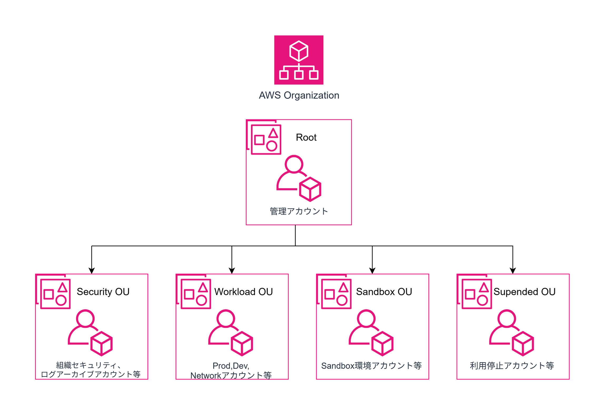

# Minimal Gov

このプロジェクトは、私が実務で設計・構築した AWS 環境をミニマル化し、ポートフォリオとしてまとめたものです。

## Architecture


## Features

### Multi Accounts
- AWS Organizations を Terraform で完全に管理
- ベストプラクティスに沿ったマルチアカウント分離を実現  


### Networking
- 完全閉域網ネットワークを構築
- TGW + Site-to-Site VPN を用いた AWS とオンプレのハイブリッドクラウド
- 運用保守拠点とAWS環境が、IP重複が発生していることをケアするため、SSMによる保守を前提にしています。

### DNS
- Route53 プライベートホストゾーンによるマルチアカウント間の名前解決
- ネットワークアカウントにリゾルバエンドポイントを設置し、オンプレと AWS 間の名前解決を実現

### Security
- ALB + WAF による本番環境への不正アクセス拒否

### Terraform Coding
- Module による再利用性を確保
- ファサードパターンを活用し、ルートモジュールをシンプルに保ちつつ柔軟なリソース定義を実現

## Repository Structure

```
.
├── infra
│   ├── modules       # Reusable Terraform modules
│   └── live          # Sample environment definitions
├── image             # Architecture diagrams
└── readme.md         # This file
```
