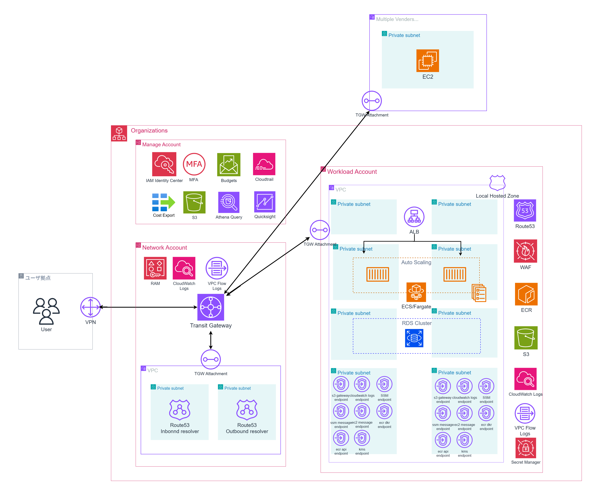

---

## 仕様

ユーザ（市役所職員と模擬）site-to-siteVPN→ネットワークアカウントのtgw→prod/devアカウントのecsアプリケーションへ、albを通じてアクセス。

運用保守→site-to-siteVPN→Networkアカウント内EC2→TGWアタッチメント＋ポートフォワーディング→prod,devの環境に到達し、操作

運用保守拠点はデータセンターで、AWS環境とIP重複が発生していると仮定。ssm接続し、ポートフォワーディングによってecs内部、rds内部に接続。

運用保守拠点内に、バックアップサーバを設置してあると想定。
prod環境のrdsからs3へ論理dmp出力→トランスファーファミリーでs3からdmpファイルをバックアップサーバに持ち込む→バックアップサーバでリストア。

aws環境は、エンドポイントでawsサービスと通信。

organizationで、セキュリティアカウントでセキュリティリソースを中央集権。

Route53はプライベートホストゾーン使用。
DNSリゾルバにより、オンプレ環境-AWS環境名前解決可能。
RAM共有で、すべてのVPCで名前解決可能。

## 全体像

3 アカウント（Security / Network / Prod+Dev）

Network VPC：踏み台 / TGW-Attach×2 / Resolver×2、SSM/EIC、必要最小限の VPCE（ssm 系＋logs/kms）

TGW：VGW, Network, Prod, Dev の 4 アタッチメント。専用 RT を 3 枚（VGW 用 / Network→Spoke 用 / Spoke→Network 用）

DNS：PHZ を Prod と Dev に作成し RAM 共有、Resolver In/Out でオンプレと疎通

ALB（Internal）＋ECS：ユーザ拠点 CIDR で ALB を制限、WAF 有効

RDS：論理ダンプを ECS タスク or Systems Manager Run Command で取得→S3

Transfer Family（VPC Hosted）→ オンプレ Backup サーバ

ログ：VPC/TGW/ALB/WAF/Trail を Security アカウント S3（KMS）へ

## 各アカウント設計

### ネットワークアカウント

